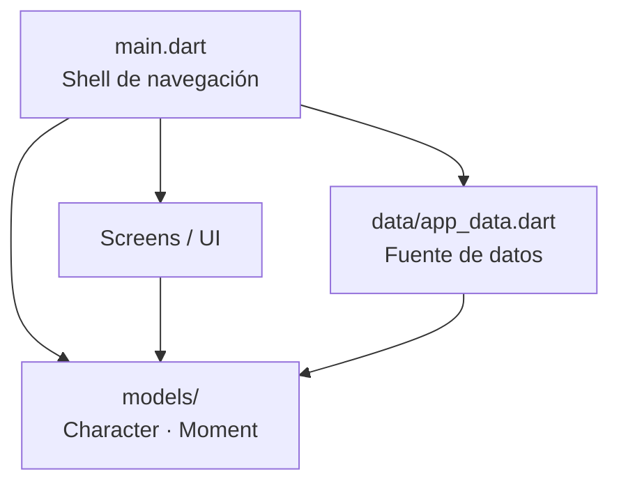

<div align="center">

# ⚔️ JoJoFanHub

**Fan app interactiva de *JoJo's Bizarre Adventure — Phantom Blood***

Aplicación móvil desarrollada en Flutter que centraliza información, multimedia
y entretenimiento de la primera parte del anime, en español.

[](https://flutter.dev)
[](https://dart.dev)
[](https://flutter.dev)
[](#-licencia)
[]()

</div>

---

## 📑 Tabla de contenido

- [Sobre el proyecto](#-sobre-el-proyecto)
- [Problema que resuelve](#-problema-que-resuelve)
- [Características](#-características)
- [Arquitectura](#-arquitectura)
- [Tecnologías y dependencias](#-tecnologías-y-dependencias)
- [Características técnicas destacadas](#-características-técnicas-destacadas)
- [Instalación y ejecución](#-instalación-y-ejecución)
- [Estructura del proyecto](#-estructura-del-proyecto)
- [Screenshots](#-screenshots)
- [Roadmap](#-roadmap)
- [Autor](#-autor)
- [Licencia](#-licencia)

---

## 🎯 Sobre el proyecto

**JoJoFanHub** es un proyecto académico de la asignatura *Introducción al Desarrollo
de Aplicaciones Móviles* que aplica conceptos reales de desarrollo móvil:
arquitectura por capas, gestión de estado, animaciones nativas, reproducción de
video en streaming y consumo de contenido multimedia externo.

La app cubre **Phantom Blood** (Parte 1, 2012): personajes, actores de doblaje,
momentos históricos del anime y un minijuego de batalla por turnos contra
Dio Brando.

## 🧩 Problema que resuelve

| Antes | Con JoJoFanHub |
|---|---|
| Información dispersa en wikis en inglés | 🎭 Ficha completa de cada personaje en español |
| Buscar clips de YouTube manualmente | 🎬 Momentos épicos con reproductor integrado |
| No hay forma de "jugar" la historia | 🎮 Batalla por turnos con mecánicas de Hamon |
| Múltiples apps para cada cosa | 📱 Todo en una experiencia móvil unificada |

Además, incluye una sección **Contrátame**: un perfil de desarrollador con
contacto directo que convierte la app en una **pieza de portafolio funcional**.

## ✨ Características

### 🏠 Portada
- Hub de exploración con accesos directos a cada sección.
- Opening oficial del anime integrado con **control de volumen en tiempo real**.
- Previews horizontales de personajes y momentos épicos.

### 👥 Personajes
- Grid con transiciones **Hero** hacia la vista de detalle.
- Detalle con `SliverAppBar` colapsable, biografía y actores de doblaje (JP/EN).

### 🎬 Momentos épicos
- Las 3 escenas definitorias de la saga con descripción completa.
- Reproductor inteligente: detección automática **YouTube → MP4 (Chewie)** con pantalla de error.

### ⚔️ Minijuego de batalla
- Elige entre **Jonathan Joestar** o **Will A. Zeppeli**, cada uno con moveset propio.
- Sistema de **HP, Hamon y Super Ataque** cargable por daño recibido.
- Dio activa **Modo Vampiro** bajo 80 HP (daño ×1.5 y moveset más fuerte).
- **Críticos** (×1.8), curaciones, ataques de drenaje y mecánica *Última Voluntad*.
- Log de batalla, animaciones de sacudida, flash y sprites con estados idle/attack.

### 📇 Contrátame
- Animación de entrada en cascada (foto con `elasticOut`, anillo pulsante, tarjetas escalonadas).
- Contacto directo: WhatsApp (deep link con mensaje), email, GitHub y LinkedIn.

## 🏗️ Arquitectura

Arquitectura por capas con separación de responsabilidades:



**Patrón aplicado:** separación UI / datos / modelos, con navegación centralizada
en un `IndexedStack` que preserva el estado de cada sección.

## 🛠️ Tecnologías y dependencias

| Paquete | Versión | Uso |
|---|---|---|
| `flutter` | SDK | Framework principal (Material 3, tema oscuro) |
| `youtube_player_iframe` | ^6.0.2 | Opening y videos de momentos épicos |
| `video_player` | ^2.11.1 | Reproductor de MP4 (fallback) |
| `chewie` | ^1.14.1 | UI de reproducción sobre `video_player` |
| `url_launcher` | ^6.3.2 | Deep links: WhatsApp, email, GitHub, LinkedIn |
| `curved_navigation_bar` | ^1.0.6 | Barra de navegación inferior animada |
| `font_awesome_flutter` | ^11.0.0 | Iconos de marca (GitHub, LinkedIn, WhatsApp) |

## 💡 Características técnicas destacadas

| Implementación | Detalle |
|---|---|
| **Máquina de estados de batalla** | `choosing → animating → dioTurn → finished` con fases de intro, selección y resultado |
| **Animaciones avanzadas** | `AnimationController` + `TweenSequence` (sacudidas), `Interval` escalonado (entrada en cascada), `AnimatedScale`/`AnimatedOpacity` |
| **Navegación preservando estado** | `IndexedStack` + swipe horizontal (`GestureDetector` con velocidad umbral) |
| **Resiliencia multimedia** | `errorBuilder` en todas las imágenes, parsing de URLs YouTube/`youtu.be`, try-catch en inicialización de video |
| **Ciclo de vida correcto** | `dispose()` de todos los controllers (video, animaciones); pausa/reanudación del opening al abrir videos |

## 🚀 Instalación y ejecución

### Requisitos previos

- [Flutter SDK](https://docs.flutter.dev/get-started/install) ≥ 3.x
- Android Studio / VS Code con emulador Android, o dispositivo físico

### Pasos

```bash
# 1. Clonar el repositorio
git clone https://github.com/yeisondev001/JoJoFanHub.git
cd JoJoFanHub

# 2. Instalar dependencias
flutter pub get

# 3. Ejecutar en dispositivo / emulador
flutter run
```

### Compilar APK de release

```bash
flutter build apk --release
# Output: build/app/outputs/flutter-apk/app-release.apk
```

### Verificaciones

```bash
flutter analyze    # Análisis estático
flutter test       # Pruebas unitarias y de widgets
```

## 📂 Estructura del proyecto

```
lib/
├── main.dart                        # Shell de navegación, opening + volumen
├── data/
│   └── app_data.dart                # Datos del anime y contenido
├── models/
│   ├── character.dart               # Modelo de personaje
│   └── moment.dart                  # Modelo de momento épico
└── screens/
    ├── portada_screen.dart          # Hub de exploración
    ├── personajes_screen.dart       # Grid de personajes
    ├── personaje_detalle_screen.dart# Detalle SliverAppBar + Hero
    ├── momentos_screen.dart         # Lista de momentos
    ├── momento_detalle_screen.dart  # Detalle + reproductor de video
    ├── acerca_screen.dart           # Información del anime
    ├── juego_screen.dart            # Batalla por turnos
    └── contratame_screen.dart       # Perfil de contacto animado
```

## 📸 Screenshots

<div align="center">

| Portada | Batalla contra Dio | Personajes |
|:---:|:---:|:---:|
|  |  |  |

</div>

> 📷 *Agrega las capturas en una carpeta `screenshots/` en la raíz del repositorio.*

## 🗺️ Roadmap

- [x] Navegación con 6 secciones y swipe horizontal
- [x] Batalla por turnos con mecánicas de Hamon
- [x] Reproductor de video con fallback YouTube/MP4
- [ ] Usar la trivia de 7 preguntas existente como modo Quiz
- [ ] Soporte iOS
- [ ] Modo claro / selector de tema
- [ ] Internacionalización (i18n)

## 👤 Autor

<div align="center">

### **Yeison Rojas Henriquez**
*Desarrollador Móvil* — Matrícula 20241822

[](https://github.com/yeisondev001)
[](https://www.linkedin.com/in/yeison-rojas-henriquez)
[](mailto:yeisonrojas03@gmail.com)

</div>

## 📄 Licencia

Proyecto académico sin fines de lucro. *JoJo's Bizarre Adventure* es propiedad
de **Hirohiko Araki / David Production** — este es un proyecto fan creado
únicamente con fines educativos.

<div align="center">
⭐ ¡Dale una estrella al repo si te gustó!
</div>
